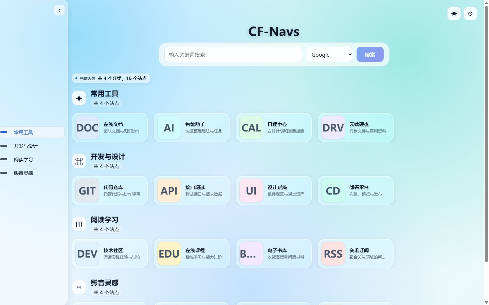
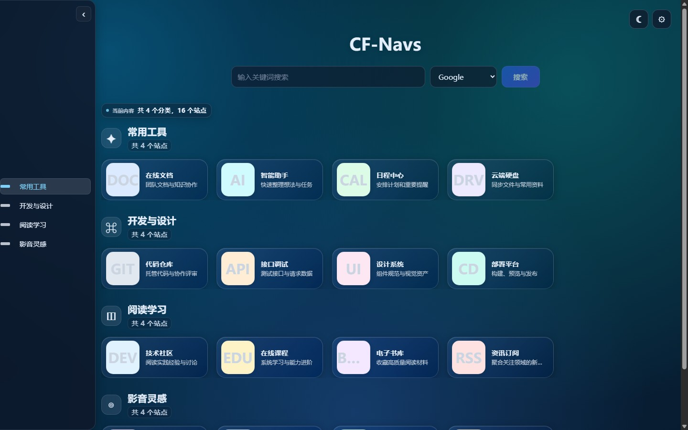
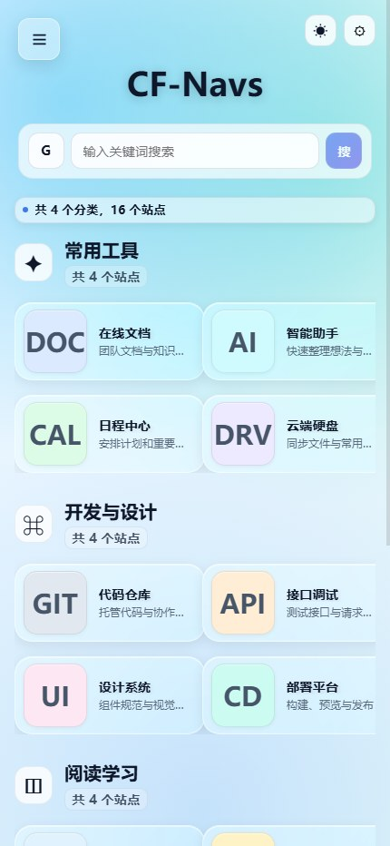
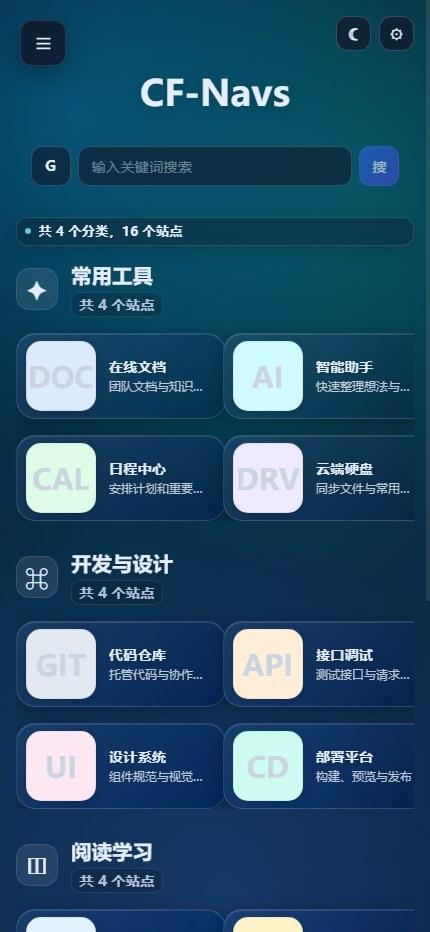
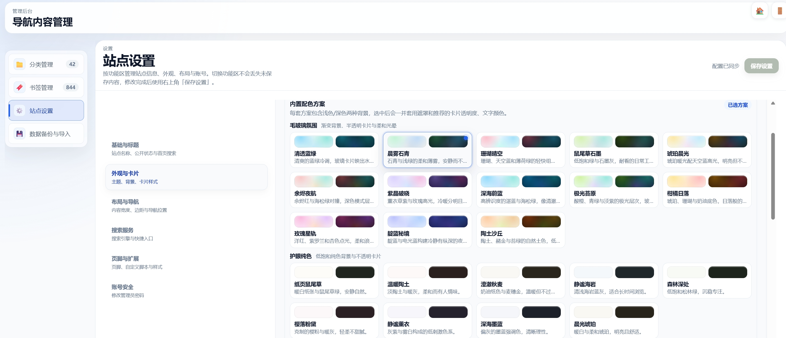

<div align="center">
  
  <h1>CF-Navs</h1>
  <p>运行在 Cloudflare Workers 上的轻量个人导航面板</p>

  <p>
    
    
    
    <a href="LICENSE"></a>
  </p>
</div>

---

## Cloudflare 一键部署（推荐）

CF-Navs 完全基于 Cloudflare 免费生态： Workers + D1 + KV，零服务器成本，Fork 后三步上线。

### 1. 所需资源

| 资源 | 绑定名 | 用途 |
|---|---|---|
| D1 Database | `DB` | 保存设置、分类和书签 |
| KV Namespace | `SESSION` | 保存管理员会话 |
| Secret | `SETUP_TOKEN` | 授权首次安装 |

> Cloudflare 会自动根据 `wrangler.toml` 创建并绑定 DB 和 SESSION，无需手动操作。

### 2. 在线部署

1. [Fork 本仓库](https://github.com/lbjxr/CF-Navs/fork)
2. 打开 Cloudflare Dashboard -> **Workers & Pages** -> **Create application** -> **Pages** -> **Connect to Git**
3. 选择 Fork 后的仓库，填写构建配置：
   - **Production branch**: `main`
   - **Build command**: `npm run build`
   - **Deploy command**: `npx wrangler deploy`
4. 保存并部署。首次部署完成后，进入 Worker 的 **设置 -> 变量和密钥**，添加：
   - 变量名: `SETUP_TOKEN`
   - 类型: **密钥**
   - 值: 一段足够长的随机字符串

<p align="center">
  
</p>

5. 访问 `https://你的站点.workers.dev/install`，输入 `SETUP_TOKEN` 创建管理员账号
6. 部署完成，后续 `git push` 到 `main` 分支会自动更新

### 3. Wrangler CLI 部署（本地命令行）

```bash
git clone https://github.com/lbjxr/CF-Navs.git
cd CF-Navs
npm install

npx wrangler login
npx wrangler d1 create cf-navs-db
npx wrangler kv namespace create SESSION
npm run setup:wrangler
npx wrangler secret put SETUP_TOKEN
npm run deploy
```

部署后访问 `/install` 完成初始化。

> CLI 部署请使用 `npm run deploy`（读取 `wrangler.local.toml`）。在线部署请使用 `npx wrangler deploy`。

### 部署后必做

- [ ] 访问 `/install` 初始化数据库和管理员
- [ ] 登录后台，进入 **站点设置 -> 页脚与扩展**，设置 `hide_password`（隐藏分类访问密码）
- [ ] 可选：绑定自定义域名（Worker 的 **域和路由** 页面）

---

## 功能特性

- **导航首页**：分类分区、书签搜索、响应式侧边/顶部导航
- **后台管理**：分类和书签的 CRUD、搜索、分页、批量删除、拖拽排序
- **外观定制**：22 套内置主题、亮暗模式、背景渐变、卡片样式
- **隐藏分类**：将分类标记为隐藏，首页不可见，仅通过 `/hide` 页面输入密码查看
- **图标支持**：Favicon、Iconify SVG、自定义图片、Emoji、文字图标
- **数据迁移**：JSON 备份恢复、Sun-Panel 和浏览器书签 HTML 导入
- **安全保障**：PBKDF2 密码哈希、HttpOnly Session、CSRF 防护、登录限流
- **性能优化**：代码分割、边缘缓存、本地快照、图标懒加载、PWA 离线回退

---

## 界面预览

<table>
  <tr>
    <td align="center" width="50%">
      <strong>亮色首页</strong><br>
      
    </td>
    <td align="center" width="50%">
      <strong>暗色首页</strong><br>
      
    </td>
  </tr>
  <tr>
    <td align="center" width="50%">
      <strong>移动端亮色</strong><br>
      
    </td>
    <td align="center" width="50%">
      <strong>移动端暗色</strong><br>
      
    </td>
  </tr>
</table>

<p align="center">
  <strong>主题与站点设置</strong><br>
  
</p>

---

## 本地开发

```bash
npm install

# 终端 1：启动 wrangler 开发服务
npm run dev

# 终端 2：启动前端开发服务
npm run dev:web
```

前端地址 `http://localhost:5173`，API 代理到 wrangler `127.0.0.1:8788`。

```bash
npm run type-check   # 类型检查
npm test             # 运行测试
npm run build        # 构建
```

---

## 技术栈

| 层级 | 技术 |
|---|---|
| 前端 | Svelte 4、TypeScript、Vite |
| Worker API | Hono、Cloudflare Workers |
| 数据与会话 | Cloudflare D1、Cloudflare KV |
| 交互与排序 | SortableJS |
| 测试 | Vitest、Svelte Check |

---

## 项目结构

```
CF-Navs/
├── src/                 # Svelte 页面、组件与浏览器端逻辑
├── worker/              # Worker 路由、中间件与 D1 数据访问
├── shared/              # 前后端共享类型与设置契约
├── public/              # 图标、PWA 与其他静态资源
├── tests/               # Vitest 单元测试
├── docs/                # 使用指南、技术参考与截图
├── scripts/             # 开发、部署与审计脚本
├── schema.sql           # D1 数据库结构
└── wrangler.toml        # Cloudflare Worker 公开配置
```

---

## 环境变量

| 名称 | 类型 | 必需 | 说明 |
|---|---|---|---|
| `DB` | D1 binding | 是 | 数据库绑定 |
| `SESSION` | KV binding | 是 | 会话存储 |
| `SETUP_TOKEN` | Secret | 首次安装 | 授权 `/install` |
| `SESSION_TTL` | Variable | 否 | 会话有效期，默认 604800 秒 |
| `INIT_ADMIN_USER` | Variable | 否 | 旧数据库升级/凭据恢复 |
| `INIT_ADMIN_PASSWORD` | Secret | 否 | 旧数据库升级/凭据恢复 |
| `RESET_ADMIN_CREDENTIALS` | Variable | 否 | 强制重置凭据的一次性标记 |

---

## 数据导入

后台支持导入以下格式：

- CF-Navs JSON 备份（覆盖或合并）
- Sun-Panel 数据
- 浏览器书签 HTML

---

## 许可证

[MIT License](LICENSE)
